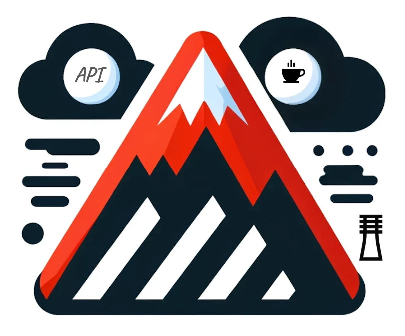

# Exoscale4J Generator


| Title                | Description                                                      |
|----------------------|------------------------------------------------------------------|
| Exoscale4J Generator | Java SDK for interacting with Exoscale Cloud Services Generator. |
| Last update          | 2024-04-21                                                       |

## **Exoscale 4 Java Generator**: 
Is a custom OpenApi generator Java native template to generate Exoscale4J a Java SDK for interaction with Exoscale could services, that was customised align with Exoscale standards.

## **Requirements**
To successfully build and use the Exoscale4j SDK, the following are required:

1. **Java 11 or higher**
2. **Maven**
## **Installation**
Clone the repository with following commands:

```shell
git clone https://github.com/exoscale/exoscale4j.git
cd exoscale4j
```
## **SDK Generation**
To generate the SDK you need to the run the following maven command:
```shell
mvn clean install
```

## **Usage**
After the building, you will find the generated code within the **sdk** directory within the root directory.


