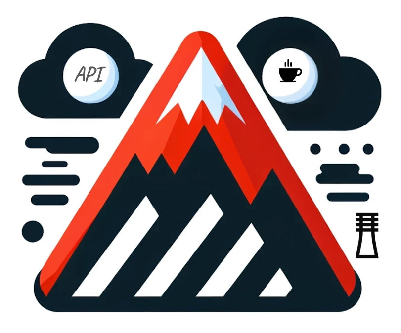

# Exoscale4J Generator


| Title                | Description                                                      |
|----------------------|------------------------------------------------------------------|
| Exoscale4J Generator | Java SDK for interacting with Exoscale Cloud Services Generator. |
| Last update          | 2024-08-08                                                       |

## **Exoscale 4 Java Generator**: 
Is a custom OpenApi generator Java native template to generate Exoscale4J a Java SDK for interaction with Exoscale could services, that was customised align with Exoscale standards.

## **Requirements**
To successfully build and use the Exoscale4j SDK, the following are required:

1. **Java 11 or higher**
2. **Maven**
## **Installation**
Clone the repository with following commands:

```shell
git clone https://github.com/exoscale/exoscale4j.git
cd exoscale4j
```
## **SDK Generation**
To generate and compile the SDK, follow the below steps:

1. **Generate the SDK sources:**
```shell
   mvn generate-sources process-resources
```
2. **Navigate to the SDK directory and install the SDK:**
```shell
   cd sdk && mvn install
```

## **Usage**
After the building, you will find the generated code within the **sdk** directory within the root directory.

## **Releasing the SDK**
To release a new version of the SDK, follow these steps:

1. **Create and push a new tag**: Commit the version update and [changelog](https://github.com/exoscale/exoscale4j/blob/main/CHANGELOG.md) with a message indicating the new changes and the release version:
    ```shell
    git tag -a v<new-version> -m "Release <new-version>"
    git push origin v<new-version>
    ```
    - Replace `<new-version>` with the new version number, by incrementing it with 1.
    - Replace `Release <new-version>`  with a message usually that describes the release, for example:
      ```plaintext
      Release 0.0.1-ALPHA 
      - Initial alpha release
      - Any other breaking changes or important notes
      ```
      This will trigger the release workflow that will release the new update and push it on Maven Central.
2. **Promote the version to Maven Central**: Once the workflow finishes without any failures, go to the Maven Central [publish page](https://central.sonatype.com/publishing) and press the Publish button.


